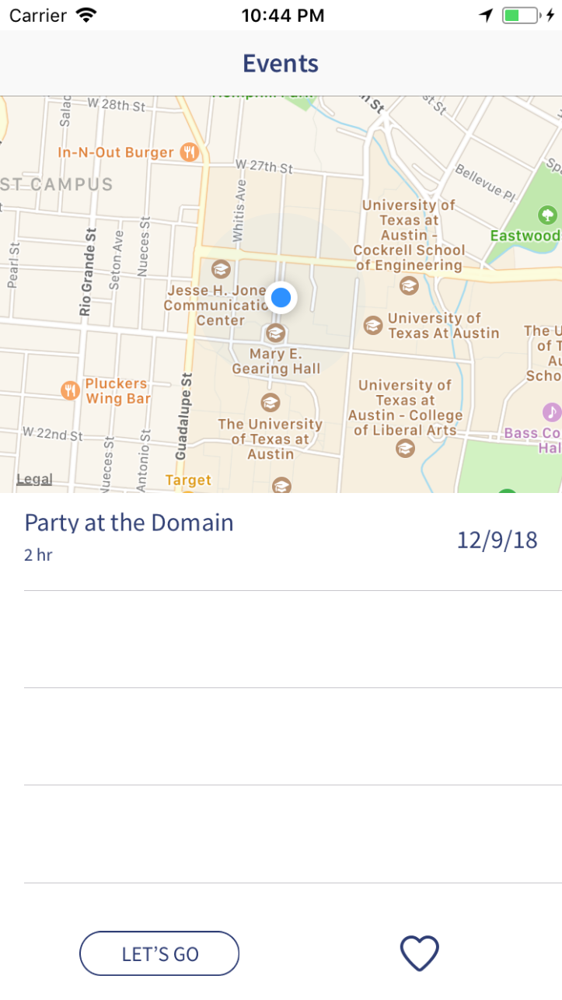
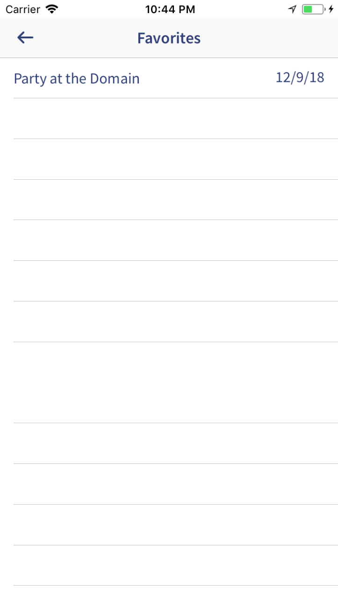

# Let's Go 

a social event finding app

### Ever find yourself with extra time on your hands? Don't know where to go out this evening? Having trouble deciding amongst a large group? Use Let's go! 

   

---

## features
1.  User specified search terms to curate list of events (in the Austin area)
2.  Map view of all events to help find closest things to do
3.  Event specific views containg descriptions and times for events
4.  Save events to your favorites to keep them on your phone forever!
5.  Coredata saves searches (until a new one is initiated) limiting reliance on redundant calls to backend.

## technical features
1.  Many views (7+)
2.  Core Data - Used to save searches, favorites, and user search settings. The app will load previous searches from coredata upon opening if available. Additionally favorites are saved even if you initiate a new search.
3.  Core animations - startup, "lets go" button, and favorite popup animation
4.  Core Location - for displaying user's location and proximity to nearby events
5.  API calls with custom JSON object to API to retrieve events. Loading remote images from S3 bucket

### extra
1. Backend API written in flask, hosted on GCP's Cloud Functions (Python BETA) - This was tough because of the new platform, and the lack of documentation for how Google is hooking the specified fucntion into Flask. The backend API went through about 40 iterations.
2. Handmade 50+ frame animation - External knowledge needed to create animation in After Effects. Also original logo
3. Tap anywhere keyboard dismissal - Haven't seen this feature on any examples given by Dr. Abraham
4. Alternative color scheme/wireframes - App was actually wireframed before putting anything into xCode, and a color scheme was picked by Nancy

## next steps
1.  Polling webapp to determine where to go with friends
2.  Facebook events API
3.  Do512
4.  Reverse geocaching for location lookup

---

## more photos

